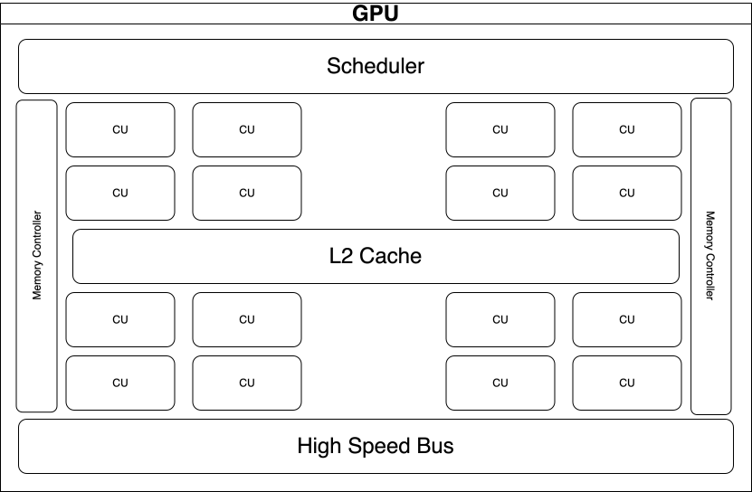
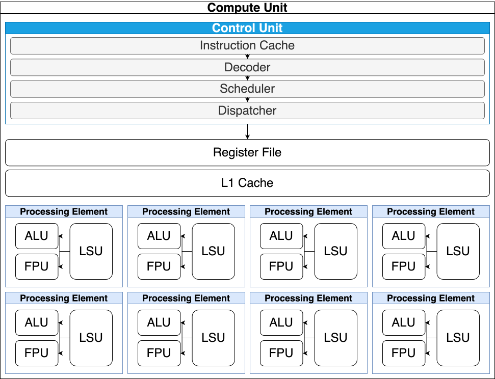

# sim-gpu

A project inspired by tiny-gpu. The aim is to essentially design and simulate a
gpu from scratch in C++. Really just to hammer into my brain C++ concepts while
having a interesting and fun structured end goal and consequently learn lots
about how GPUs actually work on a hardware level. This is an in progress project
so this README will be messy at times until I understand the general direction to
go.

### Table-Of-Contents

- [Overview](#overview)
- [Architecture](#architecture)
  - [GPU Architecture (High Level)](#gpu-architecture)
  - [Compute Unit Architecture](#compute-unit)
  - [ISA Attempt](#isa-attempt)
- [Simulation](#simulation)
- [TODO](#todo)

# Overview

# Architecture

## GPU Architecture

## Compute Unit Architecture

## ISA Attempt

For this project I plan to simulate a 32bit instruction set below the table of planned
supported operators will be a couple bitmaps describing the layout of specific instruction
types.

| Mnemonic | Op-code | Instruction Type | Description |
| :--- | :--- | :--- | :--- |
| `LOAD` | `0x00` | S-Type | (base_reg * offset) = mem_addr -> rd |
| `STORE` | `0x01` | S-Type | src-> (base_reg * offset) = mem_addr |
| `MOV` | `0x02` | M-Type | src1 -> rd |
| `ADD` | `0x03` | M-Type | rd = src1 + src2 |
| `SUB` | `0x04` | M-Type | rd = src1 - src2 |
| `MUL` | `0x05` | M-Type | rd *= src2 |
| `` | `0x06` | -Type | |
| `AND` | `0x07` | M-Type | rd = src1 AND src2 |
| `OR` | `0x08` | M-Type | rd = src1 OR src2 |
| `NOT` | `0x09` | M-Type | rd = NOT rd |
| `XOR` | `0x0A` | M-Type | rd = src1 XOR src2 |
| `LS` | `0x0B` | M-Type | rd = src1 << src2 |
| `RS` | `0x0C` | M-Type | rd = src1 >> src2 |
| `FADD` | `0x0D` | M-Type | rd = src1 + src2 |
| `FSUB` | `0x0E` | M-Type | rd = src1 - src2 |
| `FMUL` | `0x0F` | M-Type | rd = src1 * src2 |
| `FDIV` | `0x10` | M-Type | rd = src1/src2 |
| `FMAD` | `0x11` | M-Type | rd = (rd * src1) + src2 |
| `FMIN` | `0x12` | M-Type | rd = MIN(src1, src2) |
| `FMAX` | `0x13` | M-Type | rd = MAX(src1, src2) |
| `` | `0x14` | -Type | |
| `` | `0x15` | -Type | |
| `` | `0x16` | -Type | |
| `` | `0x17` | -Type | |
| `` | `0x18` | -Type | |
| `` | `0x19` | -Type | |
| `` | `0x1A` | -Type | |
| `` | `0x1B` | -Type | |
| `` | `0x1C` | -Type | |
| `` | `0x1D` | -Type | |
| `` | `0x1E` | -Type | |
| `` | `0x1F` | -Type | |
| `` | `0x20` | -Type | |
| `` | `0x21` | -Type | |
| `JUMP` | `0x22` | J-Type | idk yet |

#### S-Type Instruction

S-type instructions like LOAD and STORE access memory using a base register holding a 32bit memory address
times the immediate offset. This is used to find where to store data from a source register or what to load
into a destination register.

#### M-Type Instruction

M-type instructions access two registers (source and destination) and performs
some operation on the values within each, storing the output at the destination
register. MOV just copies the contents of the source to the destination.

#### J-Type Instruction

C-Type instructions use predicates and a memory address to jump around in
the instruction cache. Still don't know if this is useful for my GPU simulation yet nor how it
works.

# Simulation

# TODO

- [x] Figure out how to functionally test modules in systemc.
- [ ] Get a functional simulation done first without worrying about cycle timing accuracy.
  - [ ] Processing Element simulated and tested (Functional)
    - [x] ALU simulated and tested
    - [ ] FPU simulated and tested
    - [ ] LSU simulated and tested
    - [ ] SFU ~ If needed
  - [ ] Compute unit/SM simulated and tested
    - [ ] Control unit simulated and tested
      - [ ] Instruction Cache
      - [ ] Decoder
      - [ ] Scheduler
      - [ ] Dispatcher
    - [ ] Register File Simulated and tested
    - [ ] L1 Cache simulated and tested
  - [ ] GPU simulated and tested
    - [ ] Scheduler (warp?) simulated and tested
    - [ ] L2 Cache
    - [ ] Memory Controller
    - [ ] High-speed Bus?
- [ ] Implement Cycle Accurate simulation methods after functional Simulation is complete.
